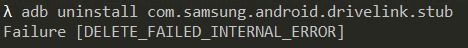

## Globally :earth_africa:
You might find it usefull to install a ***packagename app*** to simplify searching **packagenames** in your *adventures journey* to debloat your phone.
You can find them in one of your favorite playstores.

## Some of my best practices

### prerequirements
-  `adb` is installed.
-  Phone is enabled in *develop settings*.
- *usb-debugging* is enabled.

1. start an `adb server`
```s
adb devices
```
2. accept *access* on your device.
3. Look [here](bloatwarelist_S21.md) for more in debt commands.
4. When you are finished close the `adb server` by running `adb kill-server`.

### uninstall a package
Run `adb uninstall <YOUR_PACKAGE_NAME>`
example:
```s
adb uninstall com.csdroid.pkg
```
You know you did the right thing if it returns with a `succes` message.


## how 2 ...
### find packages
When you modified `<YOUR_PACKAGE_NAME>` to your likings.
- Run `adb shell pm list packages | grep <YOUR_PACKAGE_NAME>`

### find system packages
This will print a list only for system packages.
- Run `adb shell pm list packages -s`
### find 3rd party packages
This will print a list only 3rd party (or non-system) packages.
- Run `adb shell pm list packages -3`
### find enabled packages
- Run `adb shell pm list packages -e`
### find disabled packages
- Run `adb shell pm list packages -d`
### find path to the installed APK files
- Run `adb shell pm list packages -f`

## :hankey: Possible Errors :hankey:

### Package delete failed
Some packages can't be uninstalled by an user.
You might see this error:



Run `adb shell pm uninstall --user 0 <YOUR_PACKAGE_NAME>`


### unauthorized device
If you see an error like this:


It's most likely you didn't accept your computer authorization on your device.
1. Click *"Revoke USB debugging authorizations"*
2. Run `adb devices`
3. Click `accept` on your device.


